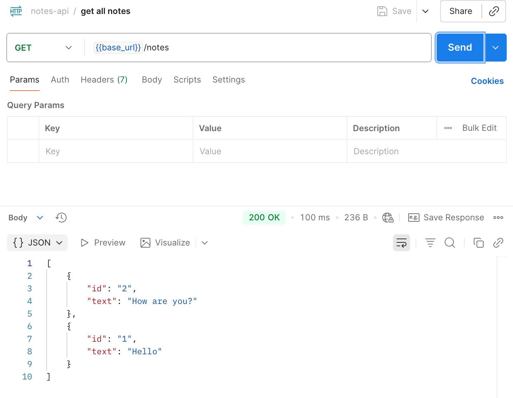
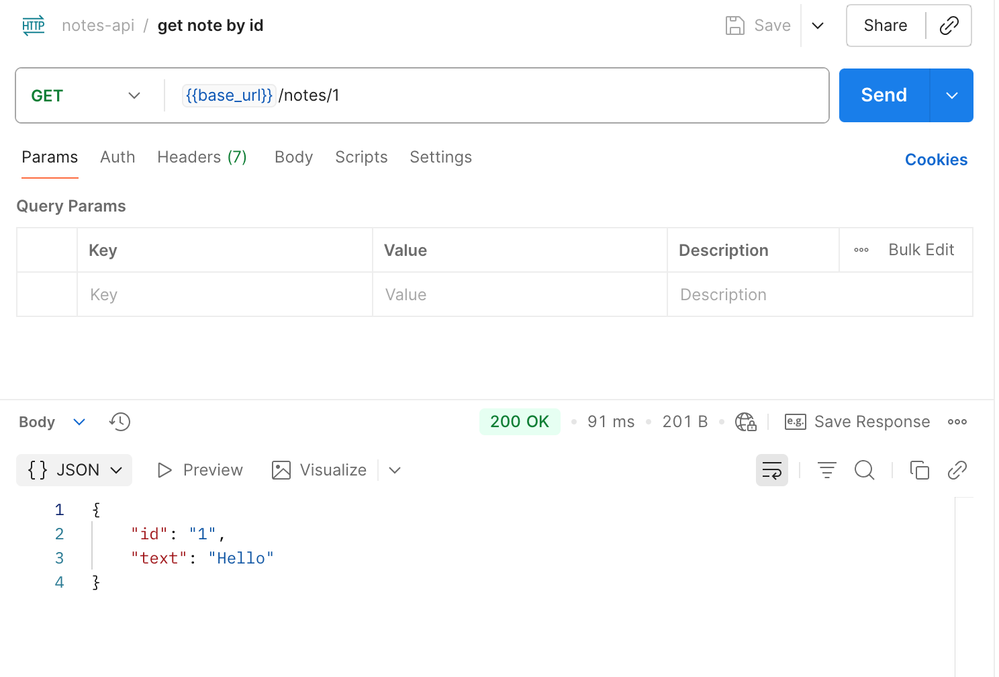
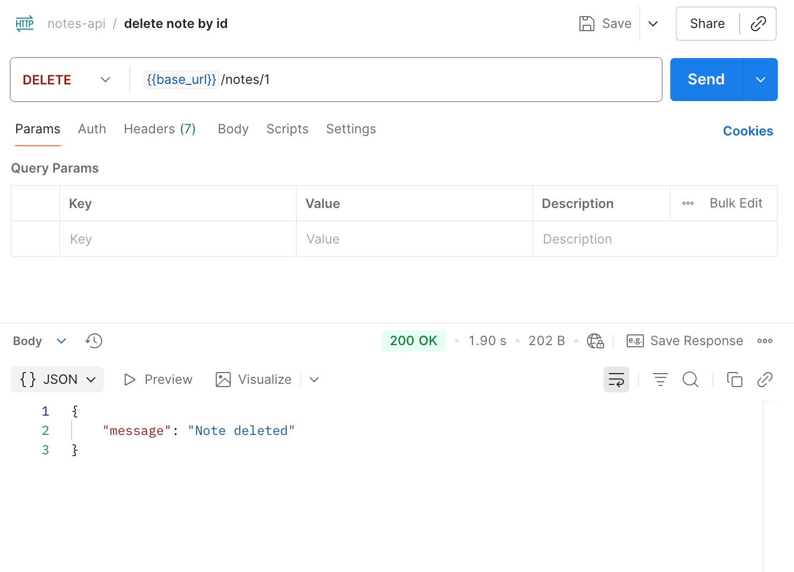
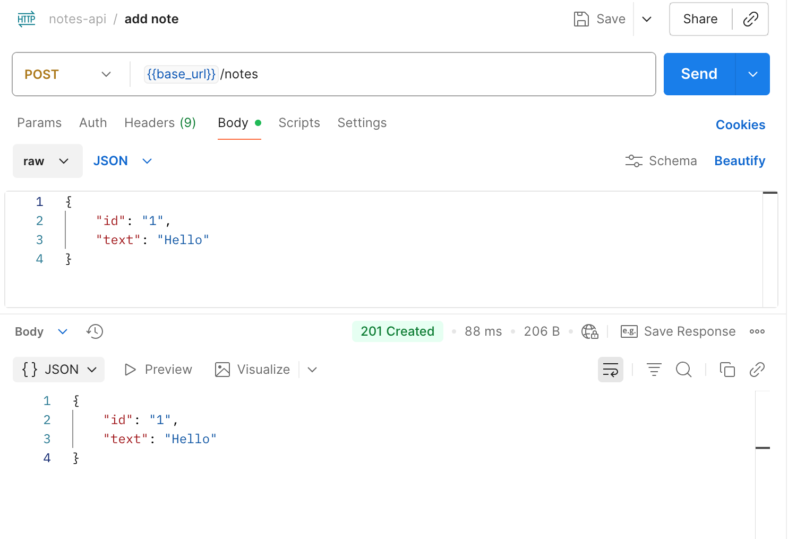

# Notes API Lambda Function

## Routes

- GET /notes - Returns array of notes object 
- GET /notes/id - Returns a note by it's ID
- DELETE /notes/id - Delete a note by ID
- POST /notes - Add a note object

### API Gateway Endpoint
[click here](https://ty0quyvzq1.execute-api.us-east-2.amazonaws.com)

## Postman Testing

- GET /notes - Returns array of notes object 

- GET /notes/id - Returns a note by it's ID

- DELETE /notes/id - Delete a note by ID

- POST /notes - Add a note object

